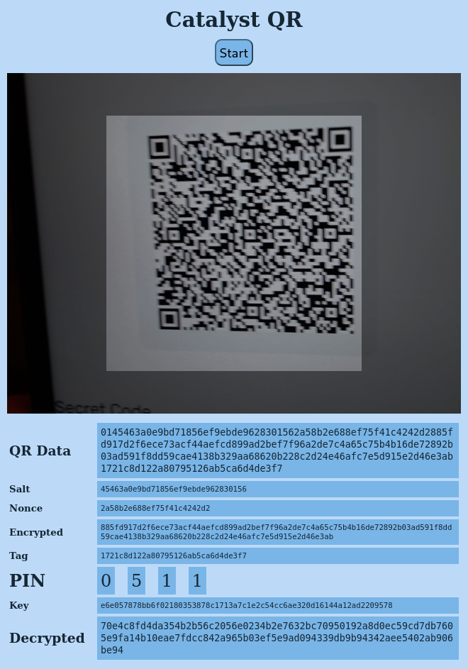
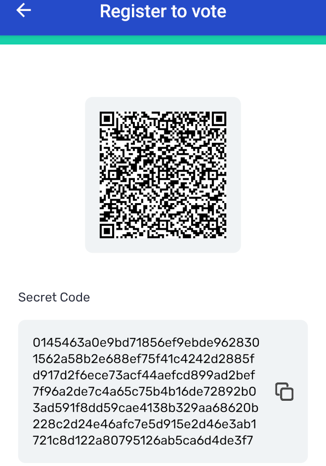

# Brute-Forcing the PIN for a Catalyst QR Code
## TLDR
With the web app at
[https://heptasean.de/catalyst-qr/](https://heptasean.de/catalyst-qr/) you
can scan your Catalyst QR code and it will brute-force your PIN in case you
have forgotten it.
(It does that on your device in your browser.
No data are transmitted to any server.)

The app is a bit slow, so be prepared that it needs up to ca. 2 hours to
scan all possible PINs (if your PIN comes early, has a low number in the
first digits, you are lucky).
You can see the progress that it makes.

I'll have to check if there are more efficient Javascript crypto libraries
that could speed that up, but it works, so I wanted to get it out while
there is still some time in the current fund.

## Example
In the first screenshot, we see the app having scanned an old, unused
Catalyst QR from me and broken the PIN `0511` from it.
In the second screenshot, the old registration given to me by Yoroi is
shown.



You can see that what Yoroi called the “secret code” is exactly the
encrypted content of the QR code.

Strangely enough, the bytes that it decrypted are totally different than
what `catalyst-toolbox` decrypts:
```shellsession
$ catalyst-toolbox qr-code decode -i example/yoroi.png -p 0511 img | bech32
70e4c8fd4da354b2b56c2056e0234b2e7632bc70950192a8d0ec59cd7db7605e
9fa14b10eae7fdcc842a965b03ef5e9ad094339db9b94342aee5402ab906be94
```
Should be investigated in future iterations, but it does get the PIN and
that was the goal.

## Context
Cardano's [Project Catalyst](https://docs.projectcatalyst.io/) uses a QR
code with a PIN to connect the voting app.
The QR code contains the signing key for signing the votes and this signing
key is encrypted by a symmetric key derived from the PIN.

The voting power is determined by registering the connection of the
corresponding public key with one or more stake addresses using
transactions on Cardano according to
[CIP 36](https://cips.cardano.org/cip/CIP-0036).
This is the job of wallet apps supporting the Catalyst system, where none
of them – that I know – supports to reuse existing voting key pairs, but
they all generate a new random key pair every time you use them to register
an account.
(… which is why I wrote ["Registering several wallets/accounts to the same
Catalyst voting
key"](https://forum.cardano.org/t/registering-several-wallets-accounts-to-the-same-catalyst-voting-key/120829)
last year to use the same voting key pair for all of my accounts and only
vote once with my whole voting power.)

For the example, the registration from July 2021 can be seen on:
[https://beta.explorer.cardano.org/en/transaction/d6619ccc0281c7652987d955446dc680ea053ac1b473e9f0e349559381e19d5c/metadata](https://beta.explorer.cardano.org/en/transaction/d6619ccc0281c7652987d955446dc680ea053ac1b473e9f0e349559381e19d5c/metadata)
The verification key of the voting key pair is in field `1` of the
metadatum label `61284`.
Would be good if a future version of the app could also extract this from
the decrypted signing key.

The voting power is determined by a snapshot a few days before the actual
vote starts and only the latest registration before that snapshot counts,
the QR codes of earlier registrations will be useless.
That only registrations before that snapshot are considered means that you
cannot just register a new one if something is wrong with your existing
registration.
If you do not find your QR code, that is a real problem, because once it is
not saved in the voting app anymore (because you reinstalled, got a new
phone, cleared the data for some reason, …), there is no place where the
signing key information still exists.
Search for the QR code!
Thoroughly!

If you just forgot your PIN, however, it can quite easily be brute-forced
from the QR code.
I already noticed last year how easy that is using the
[`catalyst-toolbox`](https://github.com/input-output-hk/catalyst-toolbox/releases/tag/v0.5.0):
https://x.com/HeptaCardano/status/1698440923162591333

**So, don't share your QR code anywhere!**
It contains the signing key for voting and anybody who has it could use
your voting registration.
(Moreover, since Catalyst does not allow to later *change* the vote, you
cannot even correct anything that person did.)

A four digit PIN is not enough to secure something if an attacker has an
unlimited number of tries, especially if they can do it offline.
Four digit PINs on your debit and credit cards are okay because they are
checked online and after three tries, you are usually permanently banned
and have to get a new card (or at least go through a cumbersome unlocking
procedure with the support).

## How does it work?
That brute-force process is easy enough if you are not afraid of the
command line of the operating system of your choice (and `catalyst-toolbox`
is available on it … which it is for Linux, Windows and Mac … and probably
could be compiled for some more).

But, since a lot of users are not that fond of such things, but they
definitely should do it themselves since it involves the knowledge of their
signing key, I decided to put this into a very simple web app that will
automatically brute-force the PIN for your Catalyst QR code.

This is also nice because – as mentioned in the thread on X linked above –
letting `catalyst-toolbox` start analysing the picture of the QR code over
and over again is a very crude way of doing this.
We can do that much better.

The web app first uses [@maslick/koder](https://github.com/maslick/koder)
to scan the QR code.

To now brute force and decrypt the scanned encrypted data, I first looked
at what `catalyst-toolbox` does:
[https://github.com/input-output-hk/catalyst-toolbox/blob/main/catalyst-toolbox/src/kedqr/payload.rs#L29-L36](https://github.com/input-output-hk/catalyst-toolbox/blob/main/catalyst-toolbox/src/kedqr/payload.rs#L29-L36)
The `decrypt` function that it calls can be found at:
[https://github.com/input-output-hk/chain-wallet-libs/blob/master/symmetric-cipher/src/lib.rs#L87-L107](https://github.com/input-output-hk/chain-wallet-libs/blob/master/symmetric-cipher/src/lib.rs#L87-L107)
And the `derive_symmetric_key` function that that in turn uses is at:
[https://github.com/input-output-hk/chain-wallet-libs/blob/master/symmetric-cipher/src/lib.rs#L156-L163](https://github.com/input-output-hk/chain-wallet-libs/blob/master/symmetric-cipher/src/lib.rs#L156-L163)

From this information, I could conclude that the app has to:
1. iterate over all 10 000 possible PINs,
2. derive a symmetric key from each PIN using the PBKDF2 algorithm with
   HMAC-SHA512 and a salt that is found in the data from the QR code,
3. try to decrypt the data using the ChaCha20Poly1305 algorithm with this
   key, a nonce that is also found in the data from the QR code and check
   if we get a tag (checksum) that is the last element found in the data
   from the QR code.

So, for the key derivation I have used the
[pbkdf2](https://www.npmjs.com/package/pbkdf2) Javascript package and for
the decryption the [chacha-js](https://www.npmjs.com/package/chacha-js)
package.

You can clone the code and install its dependencies with:
```shellsession
$ git clone https://github.com/HeptaSean/catalyst-qr.git
$ cd catalyst-qr/
$ npm install
```
I use [Vite](https://vitejs.dev/) as Javascript bundler and it has
pre-configured the `package.json` so that `npm run dev` runs a development
server that automatically updates when editing the code, `npm run build`
builds the project in `dist/`, and `npm run preview` lets you preview what
was built there.
